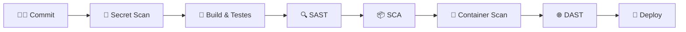

<div align="center">

# 🛡️ DevSecOps com GitHub Actions

**Aprenda a construir pipelines de CI/CD seguras, automatizadas e confiáveis usando GitHub Actions.**


</div>

---

## 📖 Sobre o projeto

Este repositório é um material de estudo prático para quem quer aprender **GitHub Actions** aplicando as boas práticas de **DevSecOps**: levar a segurança para o início do ciclo de desenvolvimento (*shift left*) e automatizar cada etapa, do commit ao deploy.

> 💡 **DevSecOps** = Desenvolvimento + Segurança + Operações. A segurança deixa de ser uma etapa final e passa a fazer parte de todo o pipeline.

---

## 🎯 O que você vai aprender

- ⚙️ **Fundamentos do GitHub Actions** — workflows, jobs, steps, runners e eventos
- 🧪 **Integração Contínua (CI)** — build, testes e lint automatizados
- 🔍 **SAST** — análise estática do código-fonte (ex.: CodeQL, Semgrep)
- 📦 **SCA** — verificação de vulnerabilidades em dependências (ex.: Dependabot, Trivy)
- 🔑 **Secret Scanning** — detecção de segredos vazados no código (ex.: Gitleaks)
- 🐳 **Segurança de containers** — scan de imagens Docker
- 🏗️ **IaC Scanning** — análise de infraestrutura como código (ex.: Checkov, tfsec)
- 🌐 **DAST** — testes dinâmicos em aplicações em execução (ex.: OWASP ZAP)
- 🔒 **Hardening de workflows** — permissões mínimas, pinning de actions por SHA e OIDC
- 🚀 **Entrega Contínua (CD)** — deploy seguro com ambientes e aprovações

---

## 🔄 Visão geral do pipeline



---

## 🗂️ Estrutura do repositório

```text
.
├── .github/
│   └── workflows/     # Workflows do GitHub Actions
├── docs/              # Anotações e explicações de cada etapa
└── README.md
```

> A estrutura será expandida conforme os módulos forem adicionados.

---

## 🚀 Como começar

1. **Faça um fork** deste repositório
2. **Clone** para sua máquina:
   ```bash
   git clone https://github.com/<seu-usuario>/devsecops-with-github-actions.git
   ```
3. Explore os workflows em `.github/workflows/`
4. Faça um push e acompanhe a execução na aba **Actions** do GitHub

---

## ✅ Boas práticas seguidas

| Prática | Por quê |
|---|---|
| `permissions:` mínimas em cada workflow | Reduz o impacto caso um token seja comprometido |
| Actions fixadas por SHA do commit | Evita ataques à cadeia de suprimentos |
| Segredos apenas via `secrets` | Nunca expor credenciais no código |
| OIDC em vez de chaves de longa duração | Credenciais temporárias para provedores de nuvem |
| Falhar o build em vulnerabilidades críticas | Segurança como *quality gate* |

---

## 📚 Referências

- [Documentação oficial do GitHub Actions](https://docs.github.com/actions)
- [Security hardening for GitHub Actions](https://docs.github.com/actions/security-for-github-actions/security-guides/security-hardening-for-github-actions)
- [OWASP DevSecOps Guideline](https://owasp.org/www-project-devsecops-guideline/)

---

<div align="center">

Feito com 💙 para estudos de DevSecOps

⭐ Se este repositório te ajudou, deixe uma estrela!

</div>
