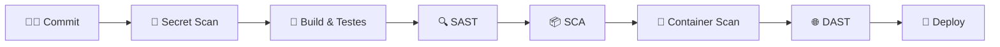
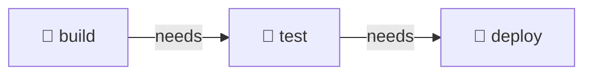

<div align="center">

# 🛡️ DevSecOps com GitHub Actions

**Aprenda a construir pipelines de CI/CD seguras, automatizadas e confiáveis usando GitHub Actions.**


</div>

---

## 📖 Sobre o projeto

Este repositório é um material de estudo prático para quem quer aprender **GitHub Actions** aplicando as boas práticas de **DevSecOps**: levar a segurança para o início do ciclo de desenvolvimento (*shift left*) e automatizar cada etapa, do commit ao deploy.

> 💡 **DevSecOps** = Desenvolvimento + Segurança + Operações. A segurança deixa de ser uma etapa final e passa a fazer parte de todo o pipeline.

---

## 🎯 O que você vai aprender

- ⚙️ **Fundamentos do GitHub Actions** — workflows, jobs, steps, runners e eventos
- 🧪 **Integração Contínua (CI)** — build, testes e lint automatizados
- 🔍 **SAST** — análise estática do código-fonte (ex.: CodeQL, Semgrep)
- 📦 **SCA** — verificação de vulnerabilidades em dependências (ex.: Dependabot, Trivy)
- 🔑 **Secret Scanning** — detecção de segredos vazados no código (ex.: Gitleaks)
- 🐳 **Segurança de containers** — scan de imagens Docker
- 🏗️ **IaC Scanning** — análise de infraestrutura como código (ex.: Checkov, tfsec)
- 🌐 **DAST** — testes dinâmicos em aplicações em execução (ex.: OWASP ZAP)
- 🔒 **Hardening de workflows** — permissões mínimas, pinning de actions por SHA e OIDC
- 🚀 **Entrega Contínua (CD)** — deploy seguro com ambientes e aprovações

---

## 🔄 Visão geral do pipeline



---

## 🗂️ Estrutura do repositório

```text
.
├── .github/
│   └── workflows/
│       └── main.yaml  # Workflow de CI (build, test e deploy)
├── action.yaml        # Action customizada "Soma" (composite)
├── soma.py            # Script Python executado pela action
└── README.md
```

> A estrutura será expandida conforme os módulos forem adicionados.

---

## ⚙️ Workflows

### `CI` — [`.github/workflows/main.yaml`](.github/workflows/main.yaml)

Primeiro workflow do repositório. Ele mostra a anatomia básica de um GitHub Action, como **encadear jobs** com `needs`, como usar **mais de um gatilho** (push e agendamento), como **consumir uma action customizada**, como **publicar artefatos** e como **rodar uma imagem Docker**.

| Item | Valor |
| --- | --- |
| **Gatilhos** | `push` na branch `main` e `schedule` diário (`cron: '47 12 * * *'`) |
| **Runner** | `ubuntu-latest` (em todos os jobs) |
| **Jobs** | `build` → `test` → `deploy` |



| Job | Depende de | O que faz |
| --- | --- | --- |
| `build` | — | Etapa de build (por enquanto, um `echo` de exemplo) |
| `test` | `build` | Executa a action [Soma](#soma--actionyaml) com `a: 1` e `b: 2`, gera o arquivo `test.txt` e publica esse arquivo como artefato com `actions/upload-artifact@v4` |
| `deploy` | `test` | Executa a imagem [`ewertoncarreira/hello-docker`](https://hub.docker.com/r/ewertoncarreira/hello-docker) do Docker Hub com `docker run` |

#### 💡 Conceitos praticados

- **Jobs x Steps:** cada *job* roda em um runner próprio e isolado; os *steps* são os comandos executados dentro de um job.
- **`needs`:** por padrão, os jobs rodam em **paralelo**. O `needs` cria uma dependência e força a execução em **sequência**: o `test` só começa se o `build` passar, e o `deploy` só começa se o `test` passar.
- **Múltiplos gatilhos (`on`):** um workflow pode reagir a vários eventos. Aqui ele roda a cada `push` na `main` **e** todo dia via `schedule`.
- **`schedule` (cron):** a expressão `47 12 * * *` significa *minuto 47, hora 12, todos os dias*. O horário é sempre em **UTC**, ou seja, 09:47 no horário de Brasília (UTC-3). Execuções agendadas rodam apenas na branch padrão, podem atrasar em horários de pico e, em repositórios públicos, são desativadas após 60 dias sem atividade.
- **Quality gate:** se um job falhar, os jobs seguintes não executam. É assim que, mais adiante, as verificações de segurança vão bloquear um deploy inseguro.
- **Usar uma action (`uses`):** o step `Test` referencia a action deste próprio repositório com `uses: carreiras/devsecops-with-github-actions@main` e passa os valores pelo `with`. Como aponta para a branch `main`, o workflow sempre executa a versão da action que está publicada nela.
- **Docker no runner:** o `ubuntu-latest` já vem com o Docker instalado, então o `docker run` baixa a imagem pública do Docker Hub e executa o container sem nenhuma configuração extra. Como não há tag, é usada a `latest`. Em um pipeline seguro, o ideal é fixar uma versão (`:1.0`) ou um digest (`@sha256:...`).
- **Artefatos:** o `actions/upload-artifact@v4` salva arquivos gerados no job (aqui, o `test.txt`) para download na página da execução, na aba **Actions**. Sem `name`, o artefato recebe o nome padrão `artifact`.

> 🧩 O job `build` ainda é um *placeholder*, e o `deploy` só executa o container dentro do runner, que é descartado ao fim do job. Nos próximos módulos eles serão trocados por etapas reais de build, deploy e segurança do pipeline.

---

## 🧱 Actions customizadas

### `Soma` — [`action.yaml`](action.yaml)

Action do tipo **composite** que recebe dois números e imprime a soma, usando o script [`soma.py`](soma.py).

| Item | Valor |
| --- | --- |
| **Tipo** | `composite` |
| **Inputs** | `a` e `b` (obrigatórios) |
| **Steps** | `actions/checkout@v2` → `actions/setup-python@v4` (Python 3.10) → `python soma.py` |

Exemplo de uso em um workflow:

```yaml
- name: Test
  uses: carreiras/devsecops-with-github-actions@main
  with:
    a: 1
    b: 2
```

#### 💡 Conceitos praticados

- **Composite action:** junta vários steps em uma action reutilizável. Ela é definida em um arquivo `action.yaml` na raiz do repositório, e cada step com `run` precisa declarar o `shell`.
- **`inputs`:** os valores passados no `with` do workflow ficam disponíveis dentro da action como `${{ inputs.a }}` e `${{ inputs.b }}`.
- **`github.action_path`:** é o diretório onde a action foi baixada no runner. Usar `${{ github.action_path }}/soma.py` garante que o script da action seja encontrado, mesmo quando a action é usada por outro repositório.
- **`argparse`:** o `soma.py` lê os argumentos `--a` e `--b` e converte para `int` antes de somar. Sem a conversão, `"1" + "2"` resultaria em `"12"`.

---

## 🗺️ Progresso

- [x] Primeiro workflow de CI (build → test → deploy)
- [x] Separação em jobs encadeados com `needs`
- [x] Execução agendada com `schedule` (cron)
- [x] Action customizada (composite) com inputs
- [x] Publicação de artefatos com `upload-artifact`
- [ ] Hardening do workflow (`permissions`, pinning por SHA)
- [ ] Secret Scanning
- [ ] SAST
- [ ] SCA
- [ ] Container Scan
- [ ] IaC Scanning
- [ ] DAST
- [ ] Deploy seguro (CD)

---

## 🚀 Como começar

1. **Faça um fork** deste repositório
2. **Clone** para sua máquina:
   ```bash
   git clone https://github.com/<seu-usuario>/devsecops-with-github-actions.git
   ```
3. Explore os workflows em `.github/workflows/`
4. Faça um push na branch `main` e acompanhe a execução do workflow **CI** na aba **Actions** do GitHub

---

## ✅ Boas práticas que serão aplicadas

| Prática | Por quê |
| --- | --- |
| `permissions:` mínimas em cada workflow | Reduz o impacto caso um token seja comprometido |
| Actions fixadas por SHA do commit | Evita ataques à cadeia de suprimentos |
| Segredos apenas via `secrets` | Nunca expor credenciais no código |
| OIDC em vez de chaves de longa duração | Credenciais temporárias para provedores de nuvem |
| Falhar o build em vulnerabilidades críticas | Segurança como *quality gate* |

---

## 📚 Referências

- [Documentação oficial do GitHub Actions](https://docs.github.com/actions)
- [Security hardening for GitHub Actions](https://docs.github.com/actions/security-for-github-actions/security-guides/security-hardening-for-github-actions)
- [OWASP DevSecOps Guideline](https://owasp.org/www-project-devsecops-guideline/)

---

<div align="center">

Feito com 💙 para estudos de DevSecOps

⭐ Se este repositório te ajudou, deixe uma estrela!

</div>
